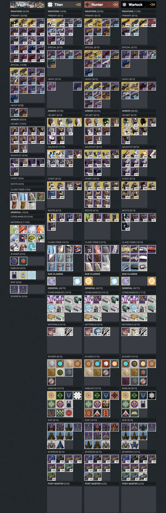

Hi, my name is Jim, and I'm an addict. A
[Destiny](http://www.destinythegame.com/) addict. I've played a lot of Destiny,
just over 530 hours between the PS4 and Xbox One versions of the game. I played
the Beta, and I've played since launch day last September. I know 530 hours may
not seem like a lot to some people out there, but to me it's been about as much
time as I could spare between work, girlfriend, cat, bills, and all other
requirements of an adult life.

For those who haven't played Destiny, please bear with me as I go through some
details.

On the Xbox One I've got two characters at the current level cap of 34 and
another at 33. On the PS4 I've got a 31 and two level 6–8 characters. You can
check my [Bungie.net Profile](https://www.bungie.net/en/Profile/254/4796258) for
more details if you're curious.

Before the second expansion, House of Wolves was released, I had pretty much all
of the hardest to come by Exotic grade weapons the game had to offer. All but
[Gjallarhorn](http://www.polygon.com/2015/5/15/8611387/destiny-gjallarhorn-best-worst)
of course, but the cruelty of Destiny's RNG is a topic for another day.

In short, I'd like to think I've played enough Destiny that my opinion of the
game and it's various mechanics and changes over time holds at least some merit.
And chances are that I'm not alone in these opinions.

When Bungie announced that the House of Wolves expansion would feature both PvP
and PvE oriented end-game content I was quite hopeful. By adding Trials of
Osiris, the first PvP end-game content, Bungie proved they were listening to and
cared about their players. PvP players would no longer be forced to play the PvE
raids in order get the best gear and reach the level cap. Instead they could do
so doing what they love the most, competing against other human players.

As I'm not a fan of PvP myself, I hoped Bungie had taken similar care with the
PvE counter-part for House of Wolves, the Prison of Elders. Sure it wasn't a
raid, they called it an “arena”, but I hoped they had made it fun and
challenging in it's own way. Unfortunately I was wrong. The Prison of Elders
takes everything good and fun about the existing raids and completely ignores
it. However it's not really fair to compare it to a raid, so instead, let's
compare it Destiny's PvE in general.

Pretty much every PvE encounter in Destiny takes place in well designed maps
allowing for various gameplay styles. Do you prefer engaging enemies from a
distance with a medium to long range weapon? There's ample space to do so with
lots of good cover to hide behind when needed. Or do you prefer running in guns
blazing with a shotgun blowing away foes at eye-poking range? There's nothing
stopping you aside from the limits of your own health bar.

When it comes to the Prison of Elders though, the whole experience is designed
around close quarters combat. You're dropped into a small round room with four
doors, each leading to a larger, but still quite small and compact room by
Destiny's standards. Those four rooms are combat zones where all the fighting
takes place. You need to get through four rounds and a final fifth boss round to
complete Prison of Elders. Each round takes place in one of the four combat
rooms. Each room is specifically designed to force you into close to medium
range combat with a few decent hiding spots to take cover. However, every hiding
spot is designed to allow enemies to easily flank you, generally with less than
a couple of seconds warning at best.

Being forced into close quarters combat isn't necessarily a problem, it's good
to be pushed out of your comfort zone sometimes. But as this is the only PvE
end-game content, and it's soley intended for close quarters combat it becomes a
bit of a problem. Then factor in that it's way too easy to die in Destiny when
you're up close and personal with enemies. Specially when the enemies in
question are high-level Majors which have way more health than normal enemies.
And Prison of Elders has a seemingly endless supply of Majors that it throws it
you.

There's a difference between a game being challenging and being punishing. I
don't consider Prison of Elders challenging, I consider it punishing. When I die
in Prison of Elders, it's rarely because we're doing things the wrong way or
using the wrong tactic, but simply because shit hit the fan. There's generally
no obvious way to go about things in a better way to avoid catastrophe, so you
just try again and hope for the best. Good examples of this is when I've spent
over two hours repeatedly trying just to take down a boss following the best
tactics available on the Internet. Sure when the boss finally dies on the 35th
or so try it feels great, but every time I hated pretty much the whole 3–6 hours
leading up to the victory. I sure as hell don't want to put myself through that
pain again.

The [Extra Credits](https://www.youtube.com/user/ExtraCreditz) YouTube channel
made an excellent video about how difficult games can be fun by getting the
balance between challenging and punishing difficulty right. I suggest you watch
it before continuing.

<iframe width="560" height="315" src="https://www.youtube.com/embed/ea6UuRTjkKs" title="YouTube video player" frameborder="0" allow="accelerometer; autoplay; clipboard-write; encrypted-media; gyroscope; picture-in-picture; web-share" referrerpolicy="strict-origin-when-cross-origin" allowfullscreen></iframe>

What makes Prison of Elders even more punishing than it already is, is the fact
that there's no checkpoint system. Meaning you can spend 6 hours at a Prison of
Elders run, only to have to leave for one reason or another, and you're left
with zero rewards and no ability to resume from where you left off. You're just
back to Round 1 no matter what. If Prison of Elders was designed to be a 1-1.5
hour long activity, that would be fine. It is after all supposed to be the
hardest thing in the game. But a level 34 Prison of Elders run can be anywhere
from 1–6 hours depending on your team and luck. And even if you've got a really
skilled team, shit can and most of the time does hit the fan repeatedly like a
broken record player.

During the second week of House of Wolves when Qodron was the boss of the level
34 Prison of Elders, I spent about 2 hours getting to the boss and another 3
hours of endless failures trying to kill him before I gave up at 1am. We were a
well organized team, each doing their specific role, but it didn't matter due to
things randomly just going horribly wrong. Did I try it again? Hell no. It took
2 hours just to get to the boss, I'm not going to spend 2 hours doing something
I've already done to get another chance at just maybe killing the boss, which
probably won't happen before I need to log off again anyway. I didn't finish the
level 34 on any character that week.

Third week Qodron was back again, but on the level 32 Prison of Elders run
instead of 34. As Bungie had made changes to the boss encounter which made it
possible to survive a specific mechanic which previously pretty much guaranteed
your death 1 out of 5 times, I decided to give it a try. And this time we did
kill Qodron. As for the level 34 Prison of Elders run that week, I didn't even
try after my experience the previous week.

This week, the fourth week, I've yet again only tried the level 32 run. This
week called “Machine Wrath”. It took about an hour to get to the boss. And the
boss encounter quickly felt about as hopeless as Qodron did at level 34 before
Bungie made their adjustments. So after 1.5 hours and about 10 or so total team
deaths, I gave up. Prison of Elders is not fun, and the more I play it the more
I hate it.

For the past 2–3 months I've had three high-level characters on Xbox One, and
every week I've made a point of completing at least the Nightfall Strike, the
Weekly Heroic Strike, and both raids. Between all my characters I found
enjoyment in being able to collect all possible 27 strange coins each week, and
hit the 21 potential exotic weapon drops (1 in Nightfall, 3 in each raid) which
would on average net me 0–6 exotic drops per week. I have a bit of a
completionist mindset as you might imagine.

Completing all weekly challenges was possible with a reasonable amount of time
sunk into Destiny before the House of Wolves came out. But Prison of Elders
makes it pretty much impossible. As a single run can take anywhere from 1–6
hours, the time and effort needed to complete the level 32, 34, and 35 Prison of
Elders each week can be staggering. Then multiply by three characters, and
factor in that there's no checkpoints to resume from, and I just can't be
bothered to even try. And that's not even factoring in that I don't actually
find Prison of Elders fun.

I still find both raids quite fun, despite having done them more times than I
care to count. But the only loot I can get from the raids is more of the same
stuff I already have. The new Etheric Light material used to upgrade weapons and
armor to the new max level is pretty much exclusive to Prison of Elders and
Trials of Osiris. There is a chance you might get one from the Nightfall Strike,
but relying on Destiny's RNG to make progress is a sure way to drive yourself
insane. On top of having no useful loot, the raids have been getting hard to run
in general, as there's now fewer people looking to do raids on LFG sites. A
couple of times it nearly took me more time to get a team together than it took
to run through Crota's End with said team.

So with no reason to do Destiny's end-game content, the raids feeling a bit
useless despite still being overall fun, I'm just starting to feel extremely
discouraged from Destiny in general. I can't really see the point in playing
anymore.

I think the best answer I can come up with right now as to why I should keep
playing is “to get Gjallarhorn”. But that seems about as likely as winning the
lottery. And even if I do get it, then what? Then I really don't have an answer
anymore.

Destiny is Bungie's little baby, and they are well within their right to change
it however they see fit. I might not agree with, or like some of their changes,
but ultimately that's my problem, and my choice if I should continue playing.

I hope Bungie know and/or realize the massive shift that Prison of Elders has
caused. A few hours invested in Destiny yields lots of fun across the whole
game, except Prison of Elders.

As for me, will I ever play Destiny again? Probably, at some point. I have some
friends that still play on a semi-regular basis, and we tend to often socialize
via co-op sessions in Destiny. Will I ever go back to seriously playing Destiny,
getting all characters to the level cap, completing all weekly challenges,
hoarding rare materials and currencies, and many other things I've been doing up
until now? Probably not.

My poor Titan might just forever remain a level 33.
