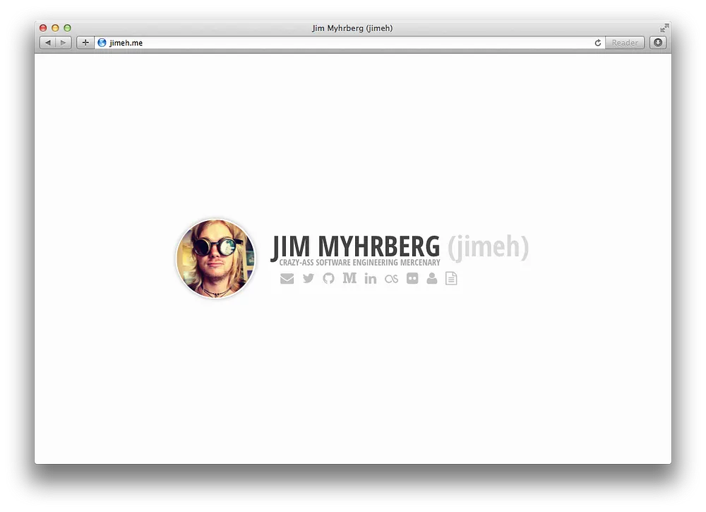
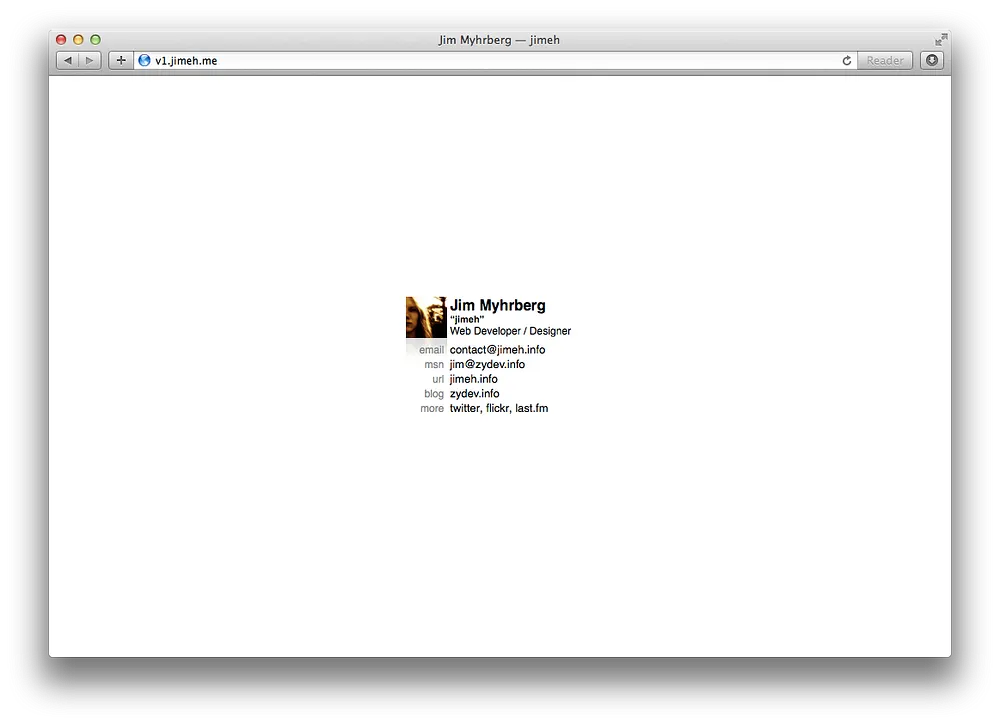
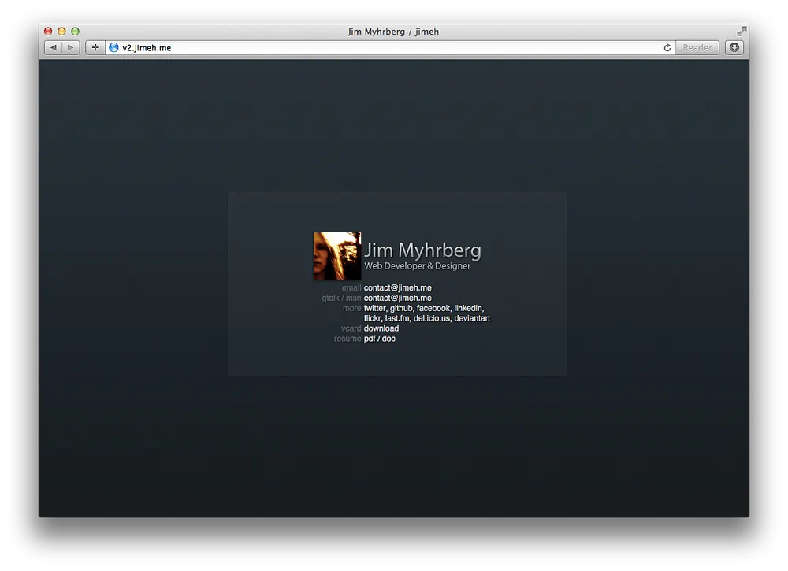
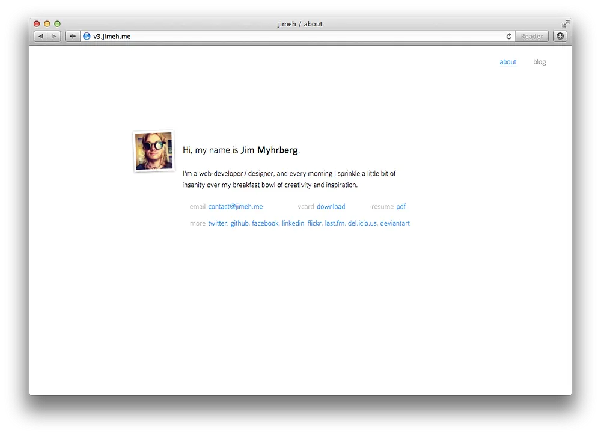

I have finally gotten around to updating my personal website. The new design is
actually something I put together two years ago while bored. I was always too
lazy to actually do anything with it though.

That changed the other day when I randomly played with
[Medium.com](https://medium.com/)'s editing and publication features, and I
decided to move my mostly ignored blog to Medium. This also inspired me to
actually put some work into rebuilding my website. Specially as I wouldn't have
to build any sort of blogging solution, I only needed a single page site which
made it easy to overcome my laziness.

The end result is now visible on [jimeh.me](http://jimeh.me/), with my blog
moved to a Medium publication with a custom domain visible at
[jimeh.io](https://jimeh.io/).

### Why Medium.com?

Last time I considered seriously using Medium was back when the service was
still pretty new. In fact, it was still operating on a invite-only basis. It's
features were pretty basic, there was no support for code blocks, and profile
customization was basically non-existent, and there was no decent way to group
your work as far as I could see. Customization has now gotten a bit better,
Publications allows you to nicely group posts, code blocks are now supported,
and custom domain support is available for Publications.

Medium has also managed to establish itself as a kind of writing/article hosting
powerhouse which operates almost as it's own little social network.

Additionally, I did use Medium back in June to
[write](/destiny-is-not-my-destiny-b9af0962a377) about Destiny. I hadn't updated
my website in years, and hardly remembered how to. So I choose Medium out of
convenice and curiosity, and was quite surprised with how well it all worked.

All of these things combined, led me to decide to give Medium a serious try for
my blog. Not to mention that I could finally put the jimeh.io domain name I've
had for years to some good use, rather than just redirect it to jimeh.me.

### History of jimeh.me

Now let's finish off this rant of a post with a gallery of all versions from
oldest to newest of my website:

_jimeh.me: [v1.0](http://v1.jimeh.me/), [v2.0](http://v2.jimeh.me/),
[v3.0](http://v3.jimeh.me/), [v4.0](http://jimeh.me/) (current)_
